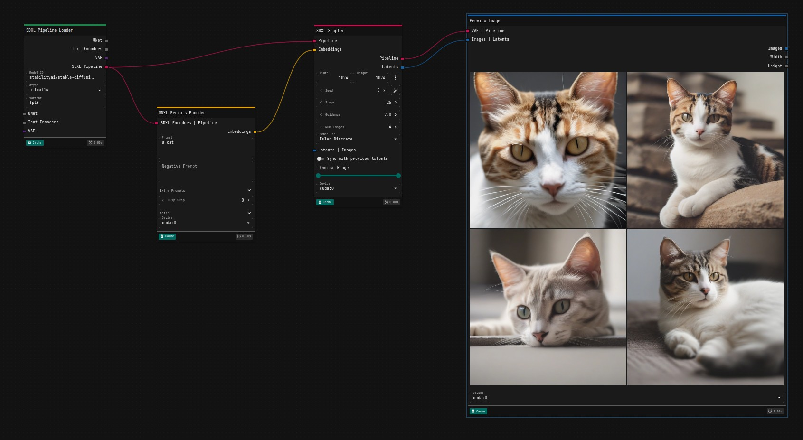

# Mellon

Mellon is a client/server application to easily interface with ML tools with a focus on [Diffusers](https://github.com/huggingface/diffusers).

> [!CAUTION]
> This is just a proof of concept and it is not ready for production. It's not even alpha-stage. DO NOT USE IT unless you know what you are doing.

## Installation

```bash
git clone https://github.com/cubiq/Mellon.git
cd Mellon
python -m venv venv
source venv/bin/activate
pip install --upgrade pip
pip install -r requirements.txt
```

On Windows before the requirements you need to install torch for your platform:

```bash
pip install torch torchvision torchaudio --index-url https://download.pytorch.org/whl/cu124
```

Then you can run the server with:

```bash
python main.py
```

or on Linux:

```bash
./run.sh
```

To access the UI, open your browser and navigate to `http://localhost:8080`.

## Configuration

Not much configuration is available at the moment. If you need to run the server on a remote machine, you can create a `config.ini` file and change the `server` section as needed. Eg:

```ini
[server]
host = 0.0.0.0
port = 8080
cors = true
cors_routes = *
```

You should be able to access the UI at `http://<ip_address>:8080`.

## Usage

This is just an alpha-stage development version. Not much is supported but you can start from the SD35 Pipeline:



## How it works

- The server loads the nodes definitions from the `__init__.py` files in the `modules` folder. The nodes are defined as Python classes with a `MODULE_MAP` object that maps the node structure.
- When the client first logs in, it gets a definition of all the nodes (route: `GET /nodes`) and the sidebar is populated.
- At this point you can drag and drop nodes in the canvas and connect them.
- Pressing `Run` will send the graph definition to the server (route: `POST /graph`). The workflow is queued and executed automatically.

## How to create a new node for a new module

The `modules` folder is for "official" modules. In the future `custom` is where you will put your custom modules.

For now create a new folder in the `modules` folder, inside of it put a python file with the same name of the directory and add an `__init__.py`. Eg:

```
modules/
    MyModule/
        __init__.py
        MyModule.py
```

In the `__init__.py` file, define the `MODULE_MAP` object. As reference you can look at the other modules.

The following is the node definition for the `BlendImages` node:

```python
MODULE_MAP = {
    'BlendImages': {
        'label': 'Blend Images',
        'category': 'image',
        'params': {
            'source': {
                'label': 'Source',
                'display': 'input',
                'type': 'image',
            },
            'target': {
                'label': 'Target',
                'display': 'input',
                'type': 'image',
            },
            'amount': {
                'label': 'Amount',
                'type': 'float',
                'display': 'slider',
                'default': 0.5,
                'min': 0,
                'max': 1,
            },
            'blend': {
                'label': 'Blend',
                'display': 'output',
                'type': 'image',
            },
        },
    }
}
```

Inside the `MyModule.py` file, create the node class. The class name must be the same as defined in the `MODULE_MAP`. In the example above, the class name is `BlendImages`.

```python
class BlendImages(NodeBase):
    def execute(self, source, target, amount):
        source = toTensor(source)
        target = toTensor(target)
        blend = source * amount + target * (1 - amount)
        blend = toPIL(blend)

        return { 'blend': blend }
```

It's important to extend your class from `NodeBase` class. That will take care of the basic validation, but technically you can build your own validation as long as the class has `__init__` and `__call__` methods.

The `execute` method expects all the parameters defined in the `MODULE_MAP`. In this case `source`, `target` and `amount`.

Note that `blend` is defined as an output parameter. The `execute` method should return a dictionary containing the `blend` key: `return { 'blend': blend }`.

You can change the name of the callback by setting the `CALLBACK` class attribute.

```python
class BlendImages(NodeBase):
    CALLBACK = 'blend_images'

    def blend_images(self, source, target, amount):
```

> [!IMPORTANT]
> This is a preliminary implementation and it will change in the future. Your suggestions are welcome.

## Client development

The client development is in a different repository: https://github.com/cubiq/Mellon-client

It's based on [ReactFlow](https://reactflow.dev/), [MUI](https://mui.com/) and [Vite](https://vitejs.dev/).

## Contact

At this stage the best way to contact me regarding the project is via [X/Twitter](https://x.com/cubiq) or [discord](https://latent.vision/discord).
